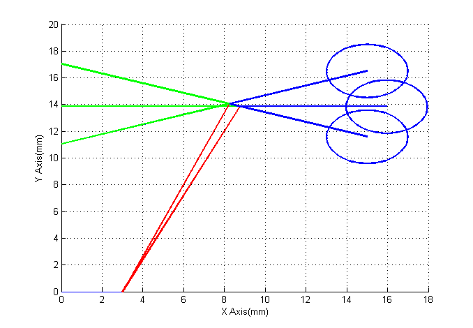

# Compliant-Mechanism

A mechanism is a mechanical device which used to transfer or transform motion, force or energy. Traditional mechanisms are mostly rigid link mechanisms whereas the name suggests the links are rigid. On the Contrary compliant mechanisms are also used to perform the same task but unlike the former they rely on the flexibility of the members, eg: - Compliant Crimping mechanism. The biggest advantage of Compliant Mechanism over Rigid link mechanisms is the reduction in the number of moving parts. These advantages make compliant mechanisms ideally suited for space or aerospace applications, where low weight and no lubrication are essential.

Inspite of Compliant mechanisms having numerous advantages, the biggest difficulty lies in the design and analysis of them. Despite the advancement in the theory relating to Compliant Mechanisms, typically analysis and design of compliant mechanisms is tougher than for a rigid link mechanism. For Compliant Mechanism, link geometry, material properties and loading all become important considerations. As most of the deflections which are involved are often large hence it rules out linear deflection equations.

 # Material Consideration for Compliant Mechanism

### Ratio of Strength to Young’s Modulus
As flexibility is desirable in complaint mechanism, therefore members having low Young’s Modulus should be preferred but apart from Flexibility, Strength of a material also plays a vital role. If you view the formulae for the maximum deflection of cantilever beam with a load applied to its edge.

You can see that the maximum deflection is proportional to the ratio of S_y/E.   
The material with the highest strength to modulus ratio will allow large deflection before failure, which is often the deciding criterion for selecting material in a Complaint Mechanism.

### Pseudo Rigid Body Model
The Pseudo Rigid Body Model is used to model the deflection of model the deflection of flexible members using rigid body components that have equivalent Force - displacement relationship. The method is particularly very helpful in the design of compliant mechanism as it provides a simple method of analysing systems that undergo large, nonlinear deflections.
Here is the brief discussion about the segments and their equivalent model which has been used in the given project:

### Small Length Flexural Pivots
 
Figure 3. Small Length Flexural Pivot
The beam has two segments, one is the short and flexible and the other is long and rigid. If the small segment is significantly shorter than the longer segment then that is called a small length flexural pivot.
The small segment is flexible, and we find deflection in the Pseudo rigid Body Model using it. 

 
Figure 4. Pseudo Rigid Body Model

2.1.2. Living Hinges
When the small segment in the small-length flexural pivots is extremely short and thin then it is called a living hinge. The pseudo rigid body model of it is a revolute joint as it Torsional stiffness is very low and hence offers no resistance to rotation.
 

### Cantilever beam with a force at the free end
 
Figure 6. Cantilever Beam
The PRBM for this segment was proposed by Howell and Midha[], and consists of two body links with one torsional spring placed at the characteristic pivot.  The length of the rigid links is calculated using γ (characteristic radius), which is a function of n or the Load factor. Load factor is the ratio of the axial force (nP) and the transverse force (P). The spring stiffness of the torsional spring k is a function of characteristic radius factor γ and the 45 beam stiffness coefficient KΘ. The beam end angle is represented by θ_o, and pseudorigid-body angle by Θ. The beam end angle and pseudo-rigid-body angle are related with the parametric angle coefficient cθ.
 

As a rule of thumb, as an approximation γ_avg can be taken as 0.85.
To define the torsional stiffness constant of the spring we define a stiffness coefficient,K_Θ . The stiffness coefficient is also a function of the load factor, hence depends on the orientation of the non - follower force. 
For a rough estimate we can take K_Θavg = 2.65.
Torsional Spring constant is given by 

Where E is the Young’s Modulus, I is Area Moment of Inertia, l is the length of the beam.

# Flowchart followed for the design of the Compliant   Mechanism
The following flowchart is followed for the design of the following Compliant Mechanism. The process is an iterative one, and the iteration continues till the final design has been obtained.

# Pseudo Rigid Body Model Design

This is the initial configuration of the Bistable rigid model, through which the Compliant version will be made.

### Mathematical Modelling

--

The visualization of the movement of the mechanism:

As we can see the given configuration is not the right choice as it doesn’t fully uncover the hole on deployment.
To calculate the energy we need to find the value of K. As we have selected the material as Titanium. Material Properties of Titanium are:-

Taking Average values of both γ and K_Θ as 0.85 and 2.65 respectively. Area moment of inertia was for a rectangular cross section   (b*h^3)/12. Taking b = 3 mm and h = 1.5mm. K turns out to be 139.2 N/rad. The Curve is shown in the graph.

The graph shows us the two stable position at βequals to 75 and 105 both. The peak is at 90 degree where the energy peaks to 0.07 Joules. We now compare the mechanism for different initial values of β  keeping R1 = 15 mm.

# Realization of the hardware of the Pseudo Rigid Body Model

After analyzing the kinematics of the mechanisms it was decided to pursue the fabrication of at least one configuration of Bistable Cover mechanism. The configuration of the link was finalized as follows:-
i)	Two links 22 mm with three holes each of diameter 3.2 mm.
ii)	Two links of 28 mm with two holes each and diameter of 3.2 mm. 
iii)	Flexural Pivots (φ 3.15) to replicate the torsional spring in the mechanism.	

The first image is of the stowed configuration, while the second image shows us the deployed configuration. Both are stable positions.

# Compliant Mechanism Design

### Rigid Body Replacement Synthesis

The simplest way of obtaining a Compliant Mechanism is by first obtaining a pseudo rigid body model, assuming constant link lengths and rigid link kinematics. Once the kinematic geometry has been finalized the structural properties of the flexible members may be chosen according to the allowable stresses. Hence it is named as rigid Body replacement synthesis. 

For a rigid body configuration of R1 = 20mm, R2 = 8.8mm, R3 =3mm,  α_int = 15.1 degrees. We then derive the geometry of the Flexible elements.

### Flexible Beam:
Length of the flexible beam represented by R1 = R1/γ = 20/0.85 = 23.5 mm

Cross section of the beam = b * h = 3 * 1.5 〖mm〗^2

### Living Hinges :
A living hinge is a thin flexible web of material that joins two rigid bodies together. Generally material to build long life living hinges is made of Polyproprene and Polyethylene. 

The center living hinge has to bend by an angle of π-2*β, that in this case is 40 degrees (taking β as 70 degrees). Using bending equation we can calculate the relationship between stress, thickness and the length of the hinge involved. 

